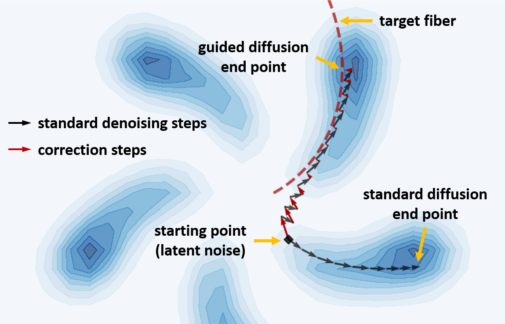
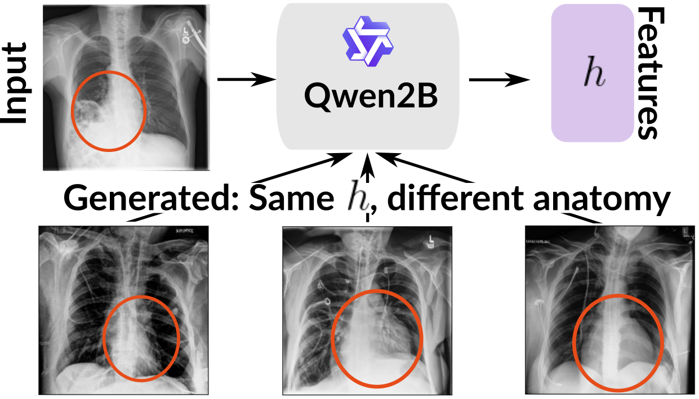
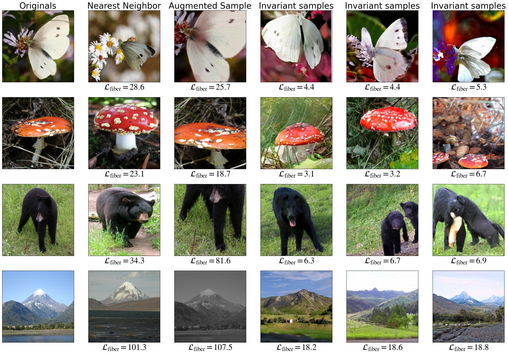

# InvarianceAuditing

Code for **"Show Me What You Don't Know: Efficient Sampling from Invariant Sets
for Model Validation"** — Armand Rousselot, Joran Wendebourg and Ullrich Köthe,
Computer Vision and Learning Lab, Heidelberg University.

*Invariance auditing* asks what a feature extractor throws away. Given a subject
model φ and a query input x, the **fiber** (or invariant set) at h = φ(x) is the
set of all inputs the model maps to the same representation. This repository
samples from that set: it takes a pretrained, unconditional diffusion model and
steers its denoising trajectory with a *fiber loss* that penalises feature
mismatch, so the sample it lands on is a natural-looking input the subject model
cannot tell apart from the query.

Nothing is trained for this. Unlike approaches that fit a dedicated generative
model per feature extractor, auditing a new model here is a single guided
sampling run against a base model you already have.

<p align="center">
  
  
</p>

*Left: correction steps (red) bend the denoising path onto the fiber, where
ordinary denoising (black) would end elsewhere. Right: the Qwen-2B vision
encoder maps a situs inversus radiograph — heart on the right — to the same
features as generated images with the heart on the left. The model does not
encode the difference.*

<p align="center">
  
</p>

*Fibers of InceptionV3 on ImageNet. Every image in a row yields nearly the same
representation, at a fiber loss far below the nearest real image — so the
differences between them are what the model discards.*

## Install

```bash
pip install -r requirements.txt          # Python >= 3.10, PyTorch
```

Two dependencies are deliberately not in that file:

- **ImageNet experiments** need [openai/guided-diffusion](https://github.com/openai/guided-diffusion)
  and its `256x256_diffusion_uncond.pt` checkpoint. Install it from a clone
  (`pip install -e .`) — its `setup.py` declares a `py_modules` that installs no
  code through a plain `pip install git+…`.
- **FID (Table 2)** uses the original TensorFlow InceptionV3 graph, which will
  not share a CUDA runtime with a modern torch wheel. Put it in a separate
  environment; see the bottom of `requirements.txt`. Everything else runs
  without TensorFlow.

Point the two environment variables at wherever your data and results should
live, and the whole repository follows them:

```bash
export FFF_DATA_ROOT=/path/to/datasets-and-checkpoints
export FFF_OUTPUT_ROOT=/path/to/samples-and-figures
```

## Auditing a model

A subject model is any `nn.Module` whose `forward(x)` returns the representation
to hold fixed, taking `x` in the base model's value range. That is the whole
interface — `experiments/imagenet/subject_models.py` wraps DINOv2, InceptionV3
and ResNet-50 this way, each in a dozen lines.

```python
import torch
from fff.ndtm import (NDTM, NDTMConfig, DiffusionModel, DiffusionSchedule,
                      DiffusionScheduleConfig, TimestepConfig,
                      get_gamma_t_fct, get_timesteps)

generative_model = DiffusionModel(base_model,
                                  DiffusionSchedule(DiffusionScheduleConfig()),
                                  class_cond_diffusion_model=False)

# Guidance strength as (start, end, t_start, t_end) segments over the diffusion:
# none while the sample is still noise, ramping up as it resolves.
gamma = [(0, 0, 1000, 800), (3, 3, 800, 600), (1, 0.5, 600, 200), (2, 10, 200, 0)]

ndtm = NDTM(generative_model=generative_model,
            subject_model=subject_model,
            hparams=NDTMConfig(N=5, u_lr=2e-3, w_terminal=1.0,
                               gamma_t=get_gamma_t_fct(gamma, max_timesteps=1000),
                               w_score_scheme="zero", w_control_scheme="zero",
                               ancestral_sampling=True,
                               compute_target_per_timestep=True))

timesteps = get_timesteps(TimestepConfig(num_steps=200))
target = subject_model(query)                       # the representation to match
_, x0_trajectory = ndtm.sample(torch.zeros_like(query), None, timesteps, y_0=target)
fiber_sample = x0_trajectory[0]                     # trajectories come back t=0 first
```

`N` is the number of gradient steps per correction, `u_lr` their learning rate,
and `w_terminal` the weight on the terminal fiber cost. Appendix C of the paper
covers what each one does; `experiments/colormnist/ablations/` sweeps them.

## Experiments

Each experiment is a package under `experiments/`, run as a module. Every
sampler takes `--seed` and records the settings and code revision its samples
came from; the two whose runs are long enough to need it — ImageNet and
CheXpert — also take `--shard`/`--num-shards` to split one setting across jobs.

| Experiment | Paper | Entry points |
|---|---|---|
| ImageNet, cue conflict | Tables 2, 5–7; Figures 5–7, 19 | `sample_ndtm`, `evaluate`, `nearest_neighbours`, `compute_fid` |
| CheXpert (classifiers, Qwen-2B) | Table 5; Figures 8, 10, 11, 16–18 | `sample_ndtm`, `sample_qwen`, `table5_fiber_losses` |
| colorMNIST benchmark | Table 3; Figures 4, 14 | `train_latent_diffusion`, `sample_ndtm`, `compute_statistics`, `make_figures` |
| Causal MNIST (ERM vs IRM) | Section 4.4; Figures 9, 12, 15 | `train_classifiers`, `train_diffusion`, `sample_ndtm` |
| HTRU2 (tabular) | Appendix B | `prepare`, `train_subject_model`, `train_diffusion`, `sample_ndtm`, `analyze` |
| NDTM ablations | Appendix C | `ablations/run_*`, `ablations/analyze_*` |

One setting, end to end:

```bash
SETTING=$FFF_OUTPUT_ROOT/imagenet/dinov2_imagenet

python -m experiments.imagenet.sample_ndtm --subject-model dinov2 --dataset imagenet \
    --base-model $FFF_DATA_ROOT/256x256_diffusion_uncond.pt \
    --num-images 10000 --out $SETTING
python -m experiments.imagenet.nearest_neighbours $SETTING   # the Table 5 baseline column
python -m experiments.imagenet.evaluate           $SETTING
```

Give each setting its own `--out`: the evaluator pools every run it is handed,
which is what makes sharding a long run across jobs work, and equally what would
average two different subject models into one number.

**[REPRODUCING.md](REPRODUCING.md) has every number and figure in the paper with
the command that produces it**, along with the settings each row was drawn under,
reference values to check against, and what to know before reading a result —
what the sampling seed moves, and what the hardware moves.

The `fff/` package holds the shared implementation: `ndtm.py` is the sampler,
`fiber_model.py` with `fff.py` / `fif.py` the trained fiber-model baselines that
colorMNIST compares against, and `evaluate/` the metrics.

## Data and checkpoints

Causal MNIST builds itself from torchvision's MNIST, and HTRU2 fetches itself
through `python -m experiments.htru2.prepare`. Downloads are off by default so
that a batch job fails fast instead of hanging on a prompt — set
`FFF_DOWNLOAD_DATASETS=1` to allow them. colorMNIST's `cc_mnist/data.h5`, the
trained checkpoints and the other derived datasets are in the GitHub release,
and belong under `$FFF_DATA_ROOT`.

The three CheXpert classifiers are on the Hugging Face Hub —
[`biomedclip-chexpert`](https://huggingface.co/RussellALA/biomedclip-chexpert),
[`convnext-chexpert-seed1`](https://huggingface.co/RussellALA/convnext-chexpert-seed1)
and [`convnext-chexpert-seed2`](https://huggingface.co/RussellALA/convnext-chexpert-seed2).
`REPRODUCING.md` gives the `$FFF_DATA_ROOT` directory each one goes in.

Four things are not ours to redistribute, and `REPRODUCING.md` says where each
one comes from and where to put it:

- **CheXpert** — request it from the
  [Stanford ML Group](https://stanfordmlgroup.github.io/competitions/chexpert/).
- **The CheXpert diffusion model**, for the same reason: a generative model
  trained on those images is close enough to them. `notebooks/chexpert_generator.ipynb`
  trains it, and everything downstream then reproduces.
- **The cue conflict stimuli** — from
  [rgeirhos/texture-vs-shape](https://github.com/rgeirhos/texture-vs-shape).
- **The situs inversus radiographs** of Figure 10, from Mayer et al. (2025). We
  may show them in the paper's figures but not redistribute them; every other
  CheXpert result is independent of them.

ImageNet is not redistributable either — point `$FFF_DATA_ROOT/imagenet` at a
copy of the validation set.

## Tests

CPU-only, and needing neither datasets nor checkpoints — everything they use is
built in the test itself:

```bash
python -m pytest                     # ~7 min
python -m pytest -m "not slow"       # ~40 s, drops the subprocess-per-script checks
```

## Citation

```bibtex
@article{rousselot2026show,
  title={Show Me What You Don't Know: Efficient Sampling from Invariant Sets for Model Validation},
  author={Rousselot, Armand and Wendebourg, Joran and K{\"o}the, Ullrich},
  journal={arXiv preprint arXiv:2603.21782},
  year={2026}
}
```

## License

BSD 3-Clause — see [LICENSE](LICENSE), with three exceptions carried in the
files themselves:

- `fff/evaluate/guided_diffusion_evaluator.py` is taken from
  [openai/guided-diffusion](https://github.com/openai/guided-diffusion) (MIT), so
  that FID matches the values the literature quotes. `get_timesteps` in
  `fff/ndtm.py` is vendored from [czi-ai/oc-guidance](https://github.com/czi-ai/oc-guidance)
  (MIT), which introduced NDTM.
- `notebooks/chexpert_classifier.ipynb` is adapted from
  [a CheXpert notebook](https://www.kaggle.com/code/shreydan/chexpert-multi-label-classifier)
  by Shreyas Daniel Gaddam ([`shreydan`](https://www.kaggle.com/shreydan)), under
  the **Apache License 2.0**. The notebook's
  first cell credits it and lists what was changed.
- The causal MNIST parts derived from
  [facebookresearch/InvariantRiskMinimization](https://github.com/facebookresearch/InvariantRiskMinimization)
  — the MLP, the environment construction and the IRMv1 penalty, in
  `experiments/causal_mnist/` — are **CC BY-NC 4.0**, so those pieces are for
  non-commercial use. Each file says so at the point it applies.

The released CheXpert classifiers are derived from CheXpert and carry Stanford's
research-use terms; see their model cards in [docs/model_cards/](docs/model_cards/).
